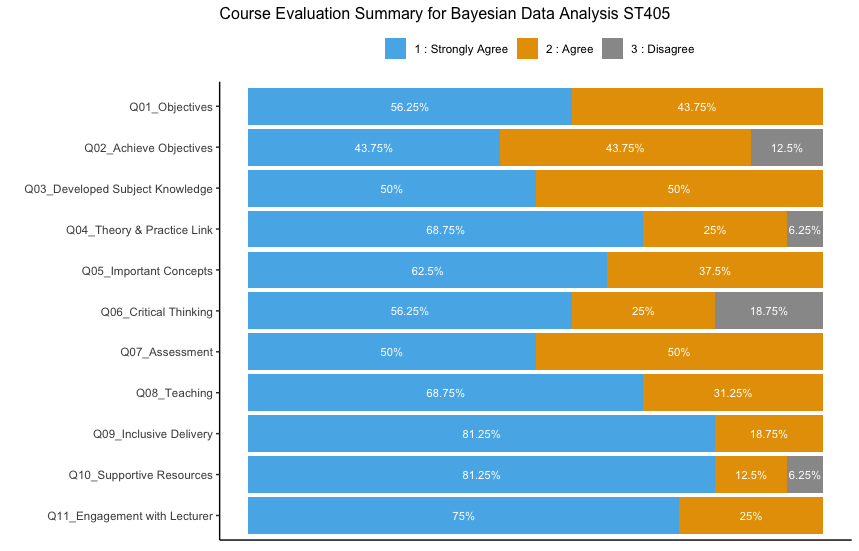

```{r}
library(tidyverse)

# read in the data
End_of_Module_Evaluation_ST405 <- read_csv("End_of_Module_Evaluation_ST405.csv")

# get in long format for likert Qs only - col1 = Q, col2 = A
dat_long <- End_of_Module_Evaluation_ST405 %>% 
              select(Response, `Q01_Objectives`:`Q11_Engagement with Lecturer`) %>% 
              pivot_longer(-Response,
                            names_to = "Q",
                            values_to = "A")

# format above for plotting barplots with ggplot
dat_to_plot <- dat_long %>% 
                group_by(Q,A) %>% 
                summarise(n = n()) %>% 
                ungroup() %>% 
                group_by(Q) %>% 
                summarise(relative = round(n*100/sum(n),1),
                n = n,                                                                                      
                A = unique(A))

# colourblind friendly palette with grey:
cbPalette <- c("#56B4E9", "#E69F00","#999999", "#009E73", "#F0E442", "#0072B2", "#D55E00", "#CC79A7")

# Create barplot with % in each category (strongly agree, agree, disagree etc) for each Q
ggplot(dat_to_plot, aes(x = fct_rev(Q),y = n, fill = A)) + 
  geom_bar(stat = "identity")+
  geom_text(aes(x = Q, label = paste0(relative,'%')),
            colour = 'white', position=position_stack(vjust=0.5), size = 3) +
  ylab('')+
  xlab('')+
  ggtitle('Course Evaluation Summary for Bayesian Data Analysis ST405')+
  coord_flip() +
  labs(fill = "") +
  scale_y_reverse() +
  theme_classic() +
  theme(legend.position = "top",
        plot.title = element_text(size=10),
        axis.title.x=element_blank(),
        axis.text.x=element_blank(),
        axis.ticks.x=element_blank()) +
  scale_fill_manual(values=cbPalette) 
```

